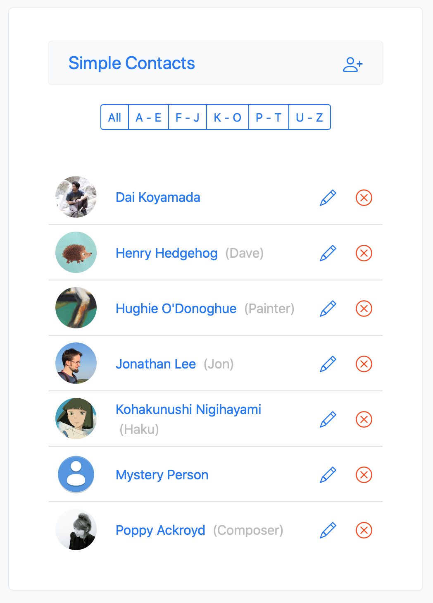
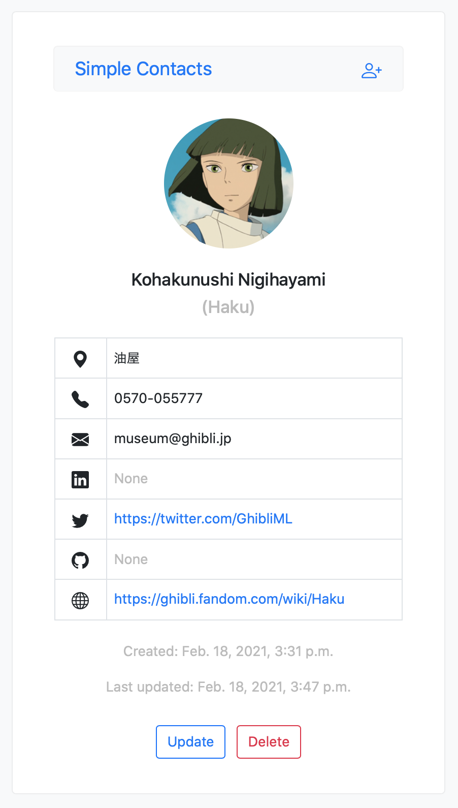
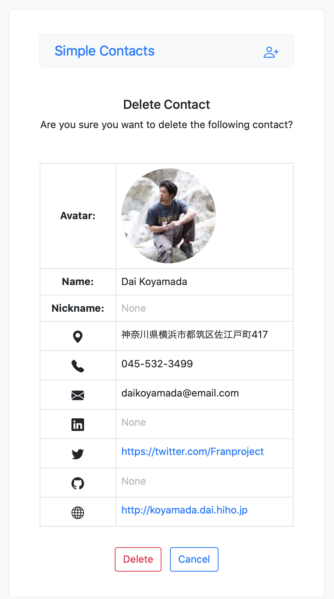

# Simple Contacts

A simple contacts app built using Django.

Essentially a self-study project for me to learn about handling images at the backend (user profile images in this case).

Here, the excellent django-imagekit library has been used to generate image thumbnails. Specifically, the SmartResize processor 
has been used to crop user-uploaded images without a user having to specify an anchor point for the cropping. It does this based
on the entropy of the image. (Please see the repo for more detail: [django-imagekit](https://github.com/matthewwithanm/django-imagekit))


Example:
```python
class Contact(models.Model):

    profile_picture = models.ImageField(upload_to='images/', blank=True)

    thumbnail = ImageSpecField(
        source='profile_picture',
        processors=[SmartResize(200, 200)],
        format='PNG',
        options={'quality': 60}
    )
```

### Built using:

* Python 3.9.1
* Django 3.1.6
* django-crispy-forms 1.11.0
* django-imagekit 4.0.2
* django-storages 1.11.1
* environs 9.3.1
* Bootstrap 5.0.0-beta2
* Visual Studio Code 1.53.2
* macOS 10.15.7

### Screenshots:

#### List view:</br>
</br>

#### Detail view:</br>
</br>

#### Delete view:</br>
</br>
